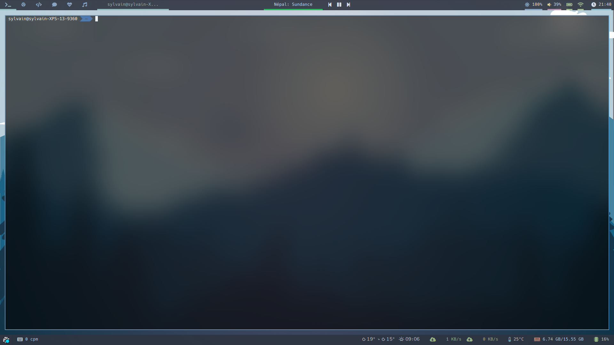
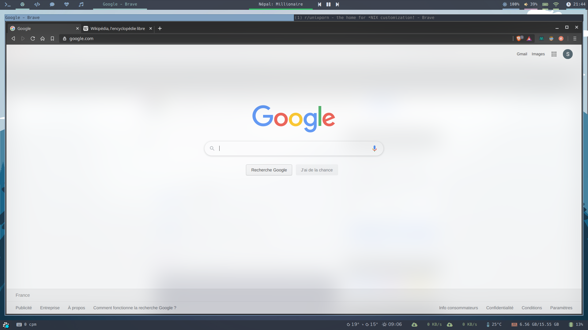
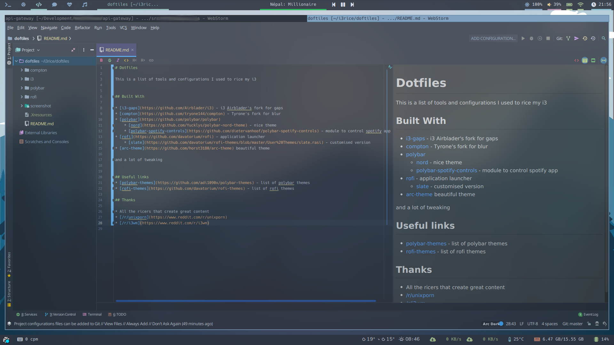
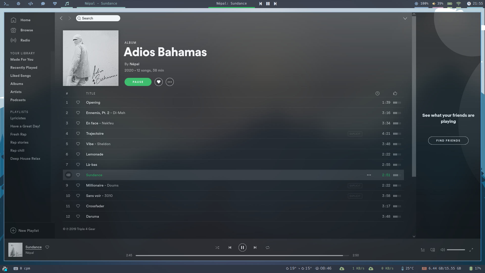
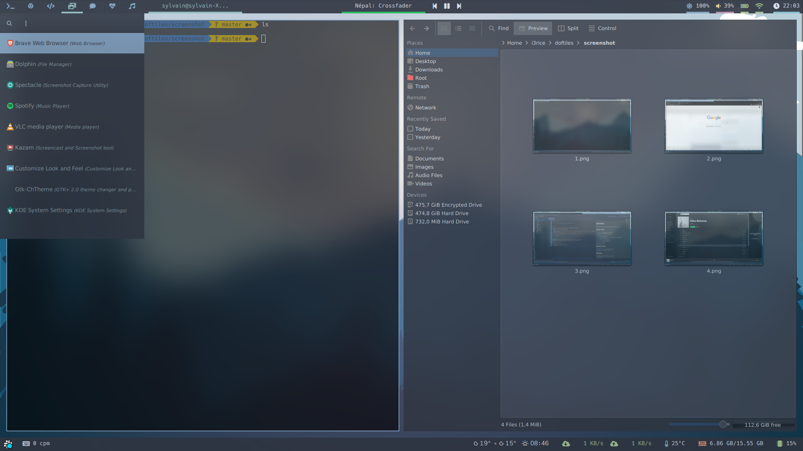

# Dotfiles

This is a list of tools and configurations I used to rice my i3

## Preview

## Built With

* [i3-gaps](https://github.com/Airblader/i3) - i3 Airblader's fork for gaps
* [compton](https://github.com/tryone144/compton) - Tyrone's fork for blur
* [polybar](https://github.com/polybar/polybar) 
    * [nord](https://github.com/Yucklys/polybar-nord-theme) - nice theme
    * [polybar-spotify-controls](https://github.com/dietervanhoof/polybar-spotify-controls) - module to control spotify app
* [rofi](https://github.com/davatorium/rofi) - application launcher
    * [slate](https://github.com/davatorium/rofi-themes/blob/master/User%20Themes/slate.rasi) - customised version 
* [i3lock-fancy](https://github.com/meskarune/i3lock-fancy) - i3-lock with a blur screenshot as background
* [dynamic-wallpaper](https://github.com/megasyl/dynamic-wallpaper) - it's my fork of [dynamic-wallpaper](https://github.com/adi1090x/dynamic-wallpaper)
* [arc-theme](https://github.com/horst3180/arc-theme) - beautiful theme
* [hack](https://github.com/source-foundry/Hack) - font
* [font awesome](https://github.com/FortAwesome/Font-Awesome) - icon font
    
and a lot of tweaking

## Useful links
* [polybar-themes](https://github.com/adi1090x/polybar-themes) - list of polybar themes
* [rofi-themes](https://github.com/davatorium/rofi-themes) - list of rofi themes

## Thanks

* All the ricers that create great content
* [/r/unixporn](https://www.reddit.com/r/unixporn)
* [/r/i3wm](https://www.reddit.com/r/i3wm)
